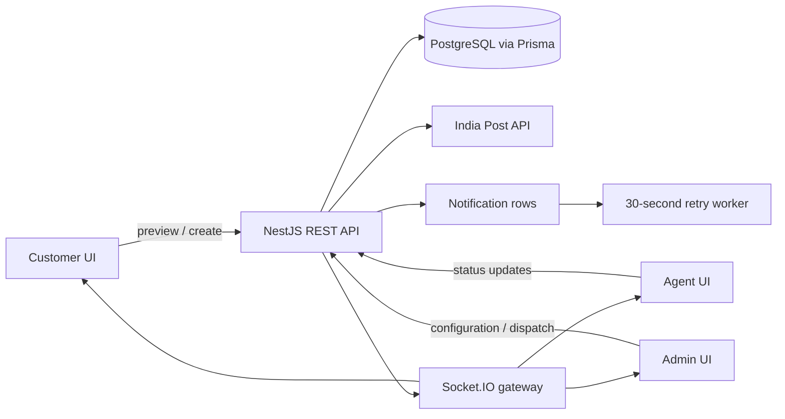

# System Design: Last-Mile Delivery Tracker

## 0. System Intent

The platform is a role-based logistics control plane: customers create and track shipments, agents execute deliveries, and admins manage pricing and dispatch.

React/Vite is deployed on Vercel; NestJS and PostgreSQL run on Render. PostgreSQL is the system of record, with REST as the recovery path and Socket.IO as the realtime extension point.

## 1. Rate Calculation Engine

The engine prioritizes **financial precision** and consistent preview/checkout results. `decimal.js` prevents floating-point currency errors, and the same pure function serves both paths.

**Algorithmic Flow:**
1. **Volumetric Weight Calculation:** The system applies industry-standard dimensional weight logic `(Length × Breadth × Height in cm) / 5000`. 
2. **Billed Weight Determination:** It compares the physical Actual Weight against the Volumetric Weight and takes the `MAX()` of the two.
3. **Temporal Rate Card Lookup:** The engine selects the latest active card by `orderType` (B2B/B2C), route type, and effective dates. The chosen card and computed amounts are stored on the order, preserving historical pricing.
4. **Slab Calculation:** The engine subtracts the `baseWeightSlab` from the Billed Weight. If there is a remainder, it is multiplied by the `extraWeightCharge` and added to the `baseCharge`.
5. **COD Surcharge:** If the payment type is Cash on Delivery, a secondary lookup retrieves the active COD configuration. The system dynamically applies either a `FLAT` fee addition or a `PERCENTAGE` multiplier against the base freight charge.

## 2. Dynamic Zone Detection Approach

Rather than relying on static, manually maintained pincode databases or complex geospatial polygon intersections (which introduce heavy external GIS dependencies), the system employs a highly robust, dynamic zone detection mechanism powered by a real-time caching layer.

**The Resolution Pipeline:**
When an order is placed, the system extracts the 6-digit pickup and drop pincodes. 
1. **Cache Layer Lookup:** It first performs an `O(1)` index lookup against the `zone_pincodes` table. 
2. **Real-Time API Fallback:** If a cache miss occurs, the backend initiates an asynchronous HTTP call to the **India Post Public API**. 
3. **State-to-Zone Mapping:** The system parses the exact State/District from the postal response and maps it against an internal hardcoded dictionary that divides India into macro-regions (North, South, East, West, Central). 
4. **Cache Hydration:** The resolved mapping is upserted into the `zone_pincodes` database. Subsequent orders utilizing the same pincode will skip the API call entirely, ensuring the system becomes faster and more resilient over time.

Zone topologies (INTRA-ZONE vs INTER-ZONE) are then instantly derived by comparing the resolved `pickupZoneId` against the `dropZoneId`.

## 3. Auto-Assignment Logic & Concurrency

The auto-assignment engine operates as an event-driven service designed to fairly distribute workloads while minimizing travel overhead. 

**Selection Algorithm:**
When a new order enters the `CREATED` state, the engine triggers a distribution sweep:
1. **Zone Proximity:** It filters the `Agent` table for personnel whose assigned operational zone exactly matches the order's `pickupZoneId`. 
2. **Availability:** It strictly filters for agents whose current status is `AVAILABLE` and whose active order count is below their personal `maxConcurrentOrders` threshold.
3. **Load Balancing:** If multiple agents qualify, the system sorts them by their active workload in ascending order, ensuring the least-burdened agent receives the dispatch. If no zone-matched agents are available, it falls back to a global pool of available agents.

**Concurrency Guards:**
To prevent race conditions where two simultaneous orders might be assigned to an agent who only has capacity for one, the assignment transaction utilizes PostgreSQL's `SELECT ... FOR UPDATE` row-level locking. This forces concurrent assignment sweeps to queue sequentially. The assignment is recorded as a system tracking event; Socket.IO provides the gateway for realtime order updates, while REST remains the recovery path after reconnects.

## 4. Failed Delivery & State Machine Handling

Failed delivery management is governed by a strict state machine to prevent orphaned orders and enforce customer intervention caps.

**Failure Lifecycle:**
1. **Agent Intervention:** An agent marks an order as `FAILED`, mandating a textual reason code (e.g., "Customer Not Available"). 
2. **Audit & Notifications:** The system atomically increments the order's `deliveryAttempts` counter, pushes an immutable event into the `OrderTracking` ledger, and enqueues an asynchronous SMS/Email notification task to the background worker.
3. **Threshold Enforcement:** The system checks the `deliveryAttempts` against the global `MAX_DELIVERY_ATTEMPTS` ceiling (default 3). 
4. **Rescheduling:** If the cap is not breached, a future date creates a `RESCHEDULED` order and a `RescheduleRequest`. After three failed attempts, customer rescheduling is rejected and support intervention is required.

